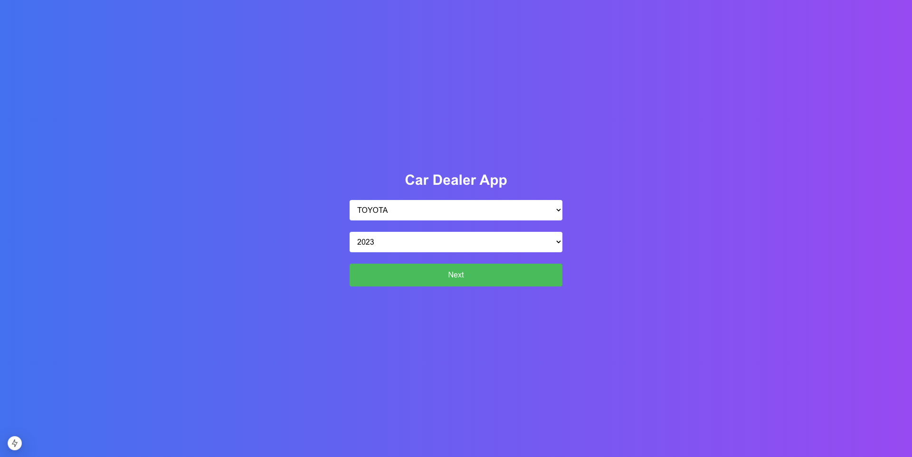
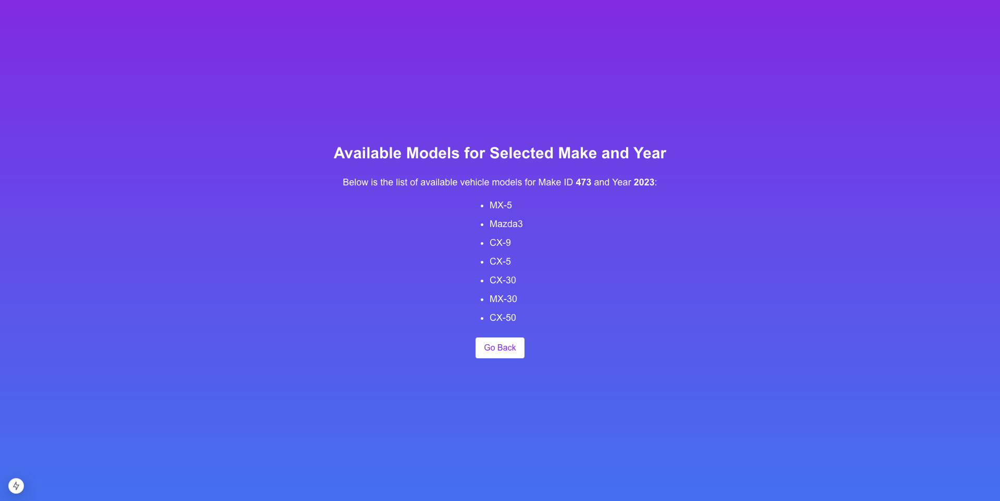

# Car Dealer App 🚗

The Car Dealer App is a modern web application built with Next.js, designed to help users filter vehicle models by manufacturer and model year. It fetches real-time data from the VPIC API and displays the results in a user-friendly and responsive interface.

---

## Features

- Filter Vehicles: Choose a vehicle manufacturer and model year using dropdown menus on the home page.
- Dynamic Results: View available models for the selected make and year on a separate result page.
- Back Navigation: Easily return to the home page using a "Go Back" button.
- Error Handling: Gracefully handle API errors and empty results.
- Responsive Design: Optimized for mobile, tablet, and desktop views.
- Gradient Styling: Beautiful gradient backgrounds for an appealing UI.

---

## Tech Stack

- Framework: [Next.js](https://nextjs.org)
- Language: TypeScript
- Styling: Tailwind CSS
- API: [VPIC API](https://vpic.nhtsa.dot.gov/api/)

---

## Screenshots

### Home Page


### Result Page


---

## Getting Started

### Prerequisites

Ensure you have the following installed on your system:

- Node.js (v16 or later)
- npm, yarn, or pnpm

### Installation

1. Clone the repository:
   ```bash
   git clone https://github.com/your-username/car-dealer-app.git

2.	Navigate to the project directory:

    cd car-dealer-app

3.	Install dependencies:

    # npm install
    or
    # yarn install
    or
    # pnpm install

4.	Run the development server:

   # npm run dev
    or
   # yarn dev
    or
   # pnpm dev

5.	Open http://localhost:3000 in your browser to see the app in action.

API Documentation

This app uses the Vehicle Product Information Catalog (VPIC) API to fetch vehicle data.

Endpoints:
1.	Get vehicle makes:
•	URL: https://vpic.nhtsa.dot.gov/api/vehicles/GetMakesForVehicleType/car?format=json
•	Description: Fetches a list of all vehicle manufacturers for cars.
2.	Get vehicle models by make and year:
•	URL: https://vpic.nhtsa.dot.gov/api/vehicles/GetModelsForMakeIdYear/makeId/{makeId}/modelyear/{year}?format=json
•	Description: Fetches a list of models for a specific make ID and year.

API Helper Functions:
•	Located in src/utils/api.ts
•	Functions:
•	fetchMakes: Fetches vehicle manufacturers.
•	fetchVehicleModels: Fetches models for a given make and year

Learn More

To learn more about the technologies used in this project, check out the following resources:
•	Next.js Documentation: https://nextjs.org/docs
•	Tailwind CSS Documentation: https://tailwindcss.com/docs
•	VPIC API Documentation: https://vpic.nhtsa.dot.gov/api/